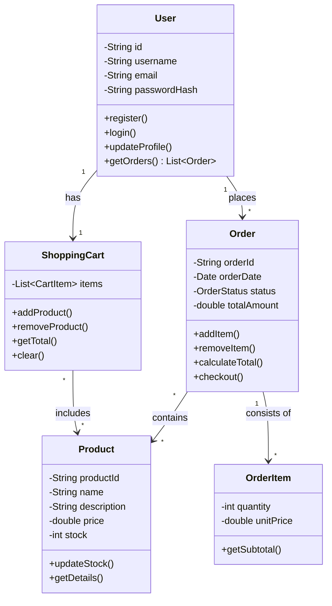

# prog_exam_2025
Материалы для подготовки к экзаменам 4 курс ИС зима 2025/26

# Полезные материалы по Computer Science

## Big O Notation (О-нотация)
### Основные концепции
| Концепция | Описание | Примеры |
|-----------|----------|---------|
| **Временная сложность** | Как быстро растёт время выполнения при увеличении входных данных | `O(1)`, `O(log n)`, `O(n²)` |
| **Пространственная сложность** | Как растёт потребление памяти при увеличении входных данных | `O(1)`, `O(n)`, `O(n²)` |
| **Асимптотический анализ** | Анализ производительности при больших объёмах данных | Отбрасывание констант, учет только доминирующего члена |

### Распространенные классы сложности
| Сложность | Название | Когда встречается | Визуализация |
|-----------|----------|-------------------|--------------|
| **O(1)** | Константная | Доступ по индексу, хеширование | ──────────── |
| **O(log n)** | Логарифмическая | Бинарный поиск, деревья | ───────/\─── |
| **O(n)** | Линейная | Линейный поиск, обход массива | ─────/\/\─── |
| **O(n log n)** | Линейно-логарифмическая | Эффективные сортировки | ────/\/\/\── |
| **O(n²)** | Квадратичная | Вложенные циклы, пузырьковая сортировка | ──/\/\/\/\─ |
| **O(2ⁿ)** | Экспоненциальная | Рекурсивные вычисления Фибоначчи | /\/\/\/\/\/\ |

### Полезные ресурсы
- [**Big O Cheat Sheet**](https://www.bigocheatsheet.com) - полная шпаргалка по сложности алгоритмов
- [**VisualGo**](https://visualgo.net) - визуализация алгоритмов с анализом сложности
- [**О-нотация на Хабр**](https://habr.com/ru/post/444594/) - подробное объяснение на русском

- 12.12.2022 Добавлены задачи для зачета

1.1. Алгоритмы: теория и практика. Методы. МНМЦ СПбГУ https://stepik.org/course/82477/syllabus

1.2. Алгоритмы: теория и практика. Структуры данных. МНМЦ СПбГУ https://stepik.org/course/82478/syllabus

Авторы книг по алгоритмам
Ахо,
Вирт,
Дасгупта,
Кормен,
Куликов,
Левитин

## UML Диаграммы

### Диаграмма прецедентов (Use Case Diagram)

**Основные элементы:**
- **Актеры** (Actors) - роли, взаимодействующие с системой
- **Прецеденты** (Use Cases) - цели, достигаемые в системе
- **Отношения**: ассоциации, включения (include), расширения (extend)

**Полезные ссылки:**
- [Диаграмма прецедентов на Wikipedia](https://ru.wikipedia.org/wiki/Диаграмма_прецедентов)
- [Примеры и шаблоны диаграмм](https://www.uml-diagrams.org/use-case-diagrams.html)

### Диаграмма классов (Class Diagram)

### Основные элементы:

**Основные понятия:**
- **Класс (Class)** - шаблон для создания объектов, описывающий их структуру и поведение
- **Атрибут (Attribute)** - характеристика или свойство класса (переменные экземпляра)
- **Метод (Operation)** - функция или процедура, которую может выполнять класс
- **Объект (Object)** - конкретный экземпляр класса

**Типы отношений между классами:**
- **Ассоциация (Association)** - обычная связь между классами
- **Наследование (Inheritance/Generalization)** - отношение "является" (is-a)
- **Реализация (Realization)** - реализация интерфейса
- **Зависимость (Dependency)** - использование одного класса другим
- **Агрегация (Aggregation)** - отношение "имеет" (has-a), слабая связь
- **Композиция (Composition)** - отношение "содержит" (contains-a), сильная связь

**Модификаторы доступа:**
- **+ (public)** - общедоступный
- **- (private)** - закрытый
- **# (protected)** - защищенный
- **~ (package)** - доступ в пределах пакета

### 🔗 Полезные ссылки:
- [Диаграмма классов на Википедии](https://ru.wikipedia.org/wiki/Диаграмма_классов) - обзорная статья
- [UML Class Diagrams на Visual Paradigm](https://www.visual-paradigm.com/guide/uml-unified-modeling-language/uml-class-diagram-tutorial/) - учебник с примерами
- [Class Diagram на UML-diagrams.org](https://www.uml-diagrams.org/class-diagrams.html) - детальное описание

### Паттерны проектирования — это типовые решения часто встречающихся проблем в проектировании программного обеспечения.

# Паттерны проектирования (Design Patterns)

### Основные элементы:

**Порождающие паттерны (Creational Patterns)** - способы создания объектов:
- **Singleton (Одиночка)** - гарантирует единственный экземпляр класса
- **Factory Method (Фабричный метод)** - определяет интерфейс для создания объектов
- **Abstract Factory (Абстрактная фабрика)** - создает семейства связанных объектов
- **Builder (Строитель)** - поэтапное создание сложных объектов
- **Prototype (Прототип)** - создание объектов через клонирование

**Структурные паттерны (Structural Patterns)** - организация классов и объектов:
- **Adapter (Адаптер)** - обеспечивает совместную работу несовместимых интерфейсов
- **Decorator (Декоратор)** - динамически добавляет новую функциональность
- **Facade (Фасад)** - предоставляет простой интерфейс к сложной системе
- **Proxy (Заместитель)** - контролирует доступ к объекту
- **Composite (Компоновщик)** - группирует объекты в древовидные структуры

**Поведенческие паттерны (Behavioral Patterns)** - взаимодействие объектов:
- **Observer (Наблюдатель)** - уведомляет об изменениях состояния
- **Strategy (Стратегия)** - инкапсулирует алгоритмы
- **Command (Команда)** - инкапсулирует запросы как объекты
- **Iterator (Итератор)** - последовательный доступ к элементам коллекции
- **State (Состояние)** - изменение поведения при изменении состояния

### 🔗 Полезные ссылки:
- [Паттерны проектирования на Refactoring.Guru](https://refactoring.guru/ru/design-patterns) - полное руководство с примерами
- [Паттерны проектирования на Википедии](https://ru.wikipedia.org/wiki/Шаблон_проектирования) - обзорная статья
- [Design Patterns на SourceMaking](https://sourcemaking.com/design_patterns) - объяснения и примеры
