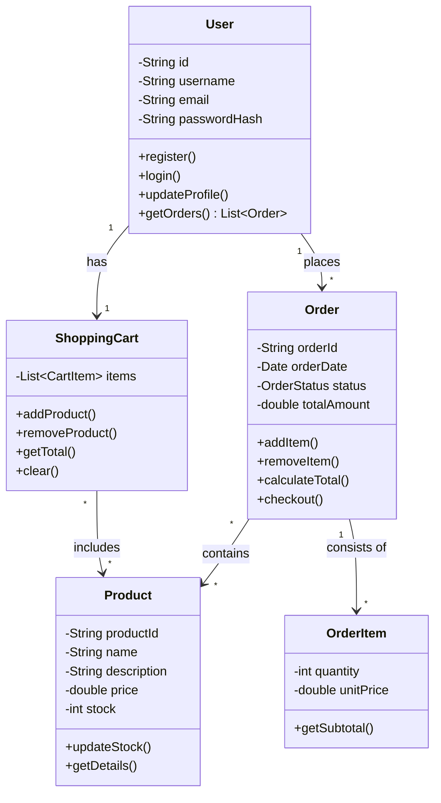

# prog_exam_2025
Материалы для подготовки к экзаменам 4 курс ИС зима 2025/26

# Полезные материалы по Computer Science

## Big O Notation (О-нотация)
### Основные концепции
| Концепция | Описание | Примеры |
|-----------|----------|---------|
| **Временная сложность** | Как быстро растёт время выполнения при увеличении входных данных | `O(1)`, `O(log n)`, `O(n²)` |
| **Пространственная сложность** | Как растёт потребление памяти при увеличении входных данных | `O(1)`, `O(n)`, `O(n²)` |
| **Асимптотический анализ** | Анализ производительности при больших объёмах данных | Отбрасывание констант, учет только доминирующего члена |

### Распространенные классы сложности
| Сложность | Название | Когда встречается |
|-----------|----------|-------------------|
| **O(1)** | Константная | Доступ по индексу, хеширование |
| **O(log n)** | Логарифмическая | Бинарный поиск, деревья |
| **O(n)** | Линейная | Линейный поиск, обход массива |
| **O(n log n)** | Линейно-логарифмическая | Эффективные сортировки | 
| **O(n²)** | Квадратичная | Вложенные циклы, пузырьковая сортировка |
| **O(2ⁿ)** | Экспоненциальная | Рекурсивные вычисления Фибоначчи |

### Полезные ресурсы
- [**Big O Cheat Sheet**](https://www.bigocheatsheet.com) - полная шпаргалка по сложности алгоритмов
- [**VisualGo**](https://visualgo.net) - визуализация алгоритмов с анализом сложности
- [**О-нотация на Хабр**](https://habr.com/ru/post/444594/) - подробное объяснение на русском

## UML Диаграммы

### Диаграмма прецедентов (Use Case Diagram)

**Основные элементы:**
- **Актеры** (Actors) - роли, взаимодействующие с системой
- **Прецеденты** (Use Cases) - цели, достигаемые в системе
- **Отношения**: ассоциации, включения (include), расширения (extend)

**Полезные ссылки:**
- [Диаграмма прецедентов на Wikipedia](https://ru.wikipedia.org/wiki/Диаграмма_прецедентов)
- [Примеры и шаблоны диаграмм](https://www.uml-diagrams.org/use-case-diagrams.html)

### Диаграмма классов (Class Diagram)

### Основные элементы:

**Основные понятия:**
- **Класс (Class)** - шаблон для создания объектов, описывающий их структуру и поведение
- **Атрибут (Attribute)** - характеристика или свойство класса (переменные экземпляра)
- **Метод (Operation)** - функция или процедура, которую может выполнять класс
- **Объект (Object)** - конкретный экземпляр класса

**Типы отношений между классами:**
- **Ассоциация (Association)** - обычная связь между классами
- **Наследование (Inheritance/Generalization)** - отношение "является" (is-a)
- **Реализация (Realization)** - реализация интерфейса
- **Зависимость (Dependency)** - использование одного класса другим
- **Агрегация (Aggregation)** - отношение "имеет" (has-a), слабая связь
- **Композиция (Composition)** - отношение "содержит" (contains-a), сильная связь

### 🔗 Полезные ссылки:
- [Диаграмма классов на Википедии](https://ru.wikipedia.org/wiki/Диаграмма_классов) - обзорная статья
- [UML Class Diagrams на Visual Paradigm](https://www.visual-paradigm.com/guide/uml-unified-modeling-language/uml-class-diagram-tutorial/) - учебник с примерами
- [Class Diagram на UML-diagrams.org](https://www.uml-diagrams.org/class-diagrams.html) - детальное описание

## Паттерны проектирования (Design Patterns, GoF)

Паттерны проектирования — типовые решения повторяющихся проблем проектирования ПО.
Классические **22 паттерна GoF** делятся на 3 группы: **порождающие**, **структурные**, **поведенческие**.

---

### 1) Порождающие паттерны (Creational) — 5
| Паттерн | Суть | Когда использовать |
|--------|------|-------------------|
| **Singleton (Одиночка)** | Один экземпляр класса на всё приложение | Логгер, конфиг, пул ресурсов |
| **Factory Method (Фабричный метод)** | Делегирует создание объектов подклассам | Когда тип создаваемого объекта заранее неизвестен |
| **Abstract Factory (Абстрактная фабрика)** | Создаёт *семейства* связанных объектов | UI под разные платформы, разные «семейства» реализаций |
| **Builder (Строитель)** | Пошагово собирает сложный объект | Сложные объекты с множеством параметров, разные представления |
| **Prototype (Прототип)** | Создание через клонирование | Дорого создавать «с нуля», проще копировать шаблон |

---

### 2) Структурные паттерны (Structural) — 7
| Паттерн | Суть | Когда использовать |
|--------|------|-------------------|
| **Adapter (Адаптер)** | Приводит один интерфейс к другому | Интеграция «чужих» библиотек/legacy API |
| **Bridge (Мост)** | Разделяет абстракцию и реализацию | Чтобы менять реализацию независимо от интерфейса |
| **Composite (Компоновщик)** | Дерево объектов: единый интерфейс для листьев и групп | Файловая система, GUI-дерево, сцены |
| **Decorator (Декоратор)** | Динамически добавляет поведение объекту | Кэширование, логирование, обёртки без наследования |
| **Facade (Фасад)** | Упрощённый интерфейс к сложной системе | Спрятать сложность подсистемы за простым API |
| **Flyweight (Приспособленец)** | Экономит память, разделяя общее состояние | Много похожих объектов (символы, частицы, тайлы) |
| **Proxy (Заместитель)** | Контролирует доступ к объекту | Lazy-loading, удалённые объекты, права доступа |

---

### 3) Поведенческие паттерны (Behavioral) — 10
| Паттерн | Суть | Когда использовать |
|--------|------|-------------------|
| **Chain of Responsibility (Цепочка обязанностей)** | Запрос проходит по цепочке обработчиков | Валидация, middleware, обработка событий |
| **Command (Команда)** | Запрос как объект (можно хранить/отменять) | Undo/Redo, очереди задач, кнопки UI |
| **Interpreter (Интерпретатор)** | Грамматика и разбор выражений | Мини-языки, фильтры, правила, выражения |
| **Iterator (Итератор)** | Последовательный обход коллекции | Чтобы не раскрывать внутреннюю структуру коллекции |
| **Mediator (Посредник)** | Централизует взаимодействие объектов | Сложные связи в UI, “чат” между компонентами |
| **Memento (Хранитель)** | Снимок состояния для отката | Сохранения, Undo/Redo, чекпоинты |
| **Observer (Наблюдатель)** | Подписка/уведомления об изменениях | События, GUI, реактивность |
| **State (Состояние)** | Поведение зависит от текущего состояния | Автоматы, статусы заказа, режимы приложения |
| **Strategy (Стратегия)** | Семейство алгоритмов под одним интерфейсом | Сортировки, разные политики расчёта/фильтра |
| **Template Method (Шаблонный метод)** | Скелет алгоритма в базовом классе | Когда шаги общие, но часть переопределяется |

---

### Полезные ссылки
- [Refactoring.Guru — паттерны (RU)](https://refactoring.guru/ru/design-patterns)
- [Wikipedia — шаблон проектирования](https://ru.wikipedia.org/wiki/Шаблон_проектирования)
- [SourceMaking — Design Patterns](https://sourcemaking.com/design_patterns)
